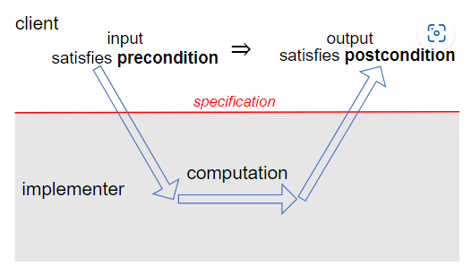

# 06 - specification

## specification structure

specification  包括 

- method signature,  函数名，函数参数， return type， exception thrown
- requires clause， 描述参数的附加限制
- effects clause， 包含返回值、exceptions 和其他影响

这三条描述了 *precondition*  和 postcondition

*precondition* 是 client， caller 的义务，需要满足参数是什么

*postcondition* 是方法实现的义务， 描述他们会返回什么，参数会发生什么改变。

**如果precondition被满足， 那么*postcondition*一定会被实现。**




## Specification in java

example code

```java
/**
 * @param tiles     a string of 7 uppercase letters.
 * @param crossings contains only uppercase letters, without duplicates.
 * @return a list of words where each word can be made by taking
 *         letters from tiles and at most 1 letter from crossings.
 */
public static List<String> scrabble(String tiles, String crossings) {
    if (tiles.length() != 7) { throw new RuntimeException(); }
    return new ArrayList<>();
}
```


## 不要使用空指针


## 使用空字符串或者空列表 而不是 None


## specification 和 unit test

对于 unit test 来说，每次只会测试一个 specification， 其假设是其他模块运行完全正确。

## 

## 对于 mutating methods 的定义

有些函数会对参数的引用进行**修改**， 这叫做 **side effect**。 

side effect 定义在 post condition中，例如 

```java
static boolean addAll(List<T> list1, List<T> list2)
requires: list1 != list2
effects: modifies list1 by adding the elements of list2 to the end of it, and returns true if list1 changed as a result of call
```


## Exceptions

对于 callee 来说，如果有异常值的话，使用 print 打印到屏幕上是非常不方便的，exception 提供了更明显的渠道。

-  callee 抛出异常

  ```java
  LocalDate lookup(String name) throws NotFoundException {
      ...
      if ( ...not found... )
          throw new NotFoundException();
      ...
  ```

- caller 接受异常

  ```java
  BirthdayBook birthdays = ...
  try {
      LocalDate birthdate = birthdays.lookup("Alyssa");
      // we know Alyssa's birthday
  } catch (NotFoundException nfe) {
      // her birthday was not in the birthday book
  }
  ```

  

  ## Exception 分类

- checked exceptions 应该是编译器能在 编译时就能找到的 bug， java需要在函数签名上写 throw exception

  ``` java
  /**
  * Compute the integer square root.
  * @param x value to take square root of
  * @return square root of x
  * @throws NotPerfectSquareException if x is not a perfect square
  */
  int integerSquareRoot(int x) throws NotPerfectSquareException
  ```

  

- unchecked exceptions  是 runtime 是发现的bug， 函数签名上不需要写 throw。

  ```java
  /**
  * Pops a value from this queue.
  * @return next value in the queue, and removes the value from the queue
  * @throws EmptyQueueException if this queue is empty
  */
  int pop()
  ```

  

